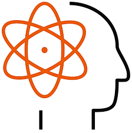
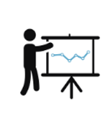
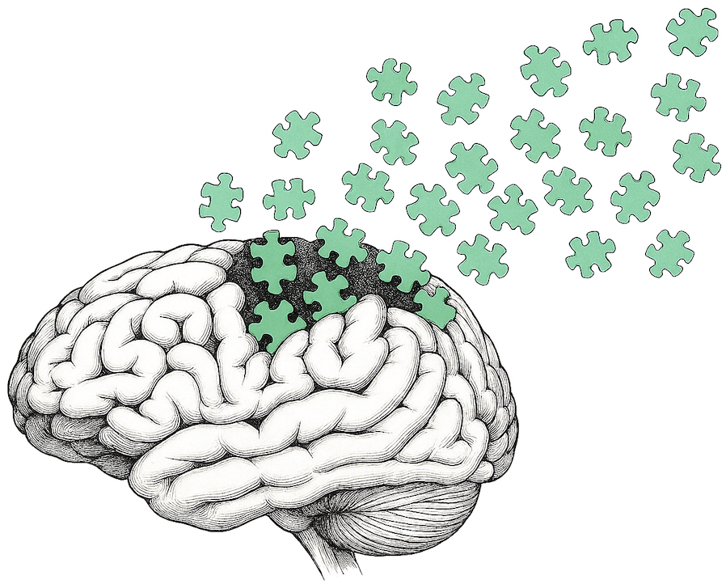
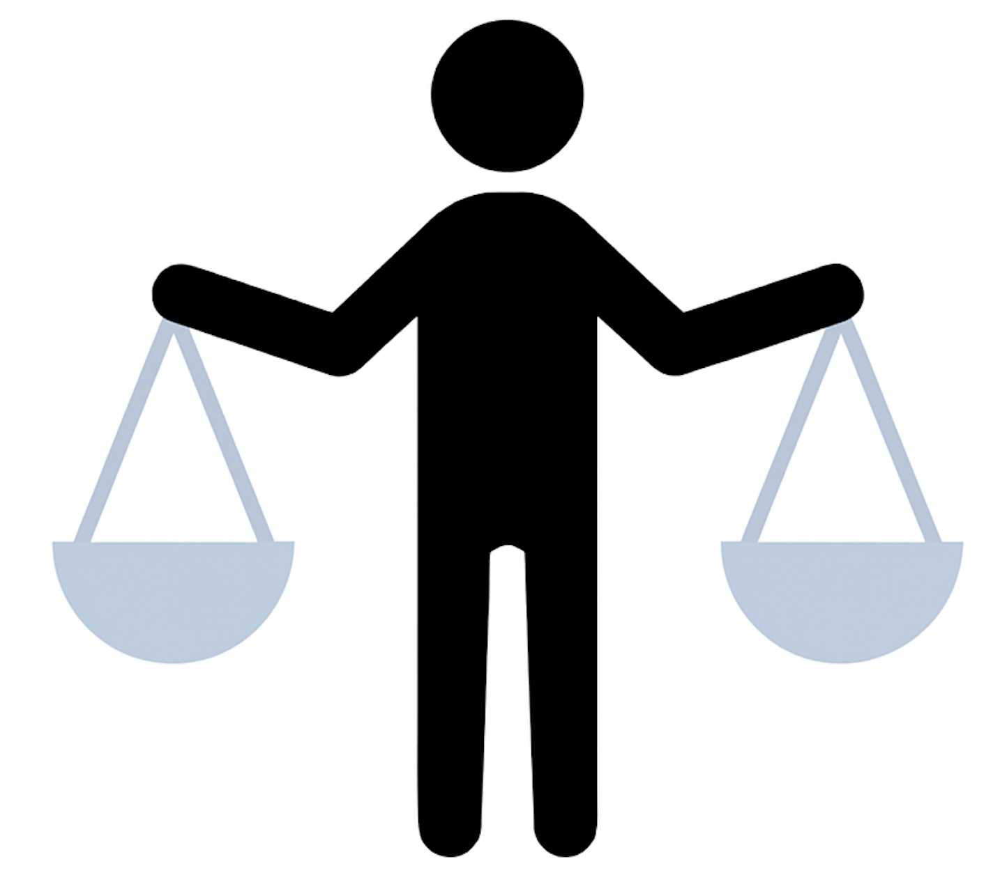

<br> <br>

<link
  rel="stylesheet"
  href="https://cdnjs.cloudflare.com/ajax/libs/font-awesome/6.5.0/css/all.min.css"
/>

```{css, echo = FALSE}

    
d-article h2{
    display: none !important;
    }
    
.btn {
  color: #6da444;                
  text-decoration: none;          
  padding: 2px 2px;            
  font-size: 18px;              
  font-weight: bold;            
  margin-right: 10px;          
  display: inline-flex;          
  align-items: center;           
  gap: 8px;                     
  transition: background-color 0.3s ease, transform 0.2s ease;
   border: 2px;
}
.btn:hover {
  transform: translateY(-2px); 
  text-decoration: none !important; 
  border: 1px;
}

d-title {
    display: none;
    }
    

```

<div style="text-align: justify;">

<h1>

PSY301: Scientific Thinking

</h1>

Psychology is the scientific study of the mind and behavior, but what does it mean to study something scientifically? In this course, you will learn how psychologists measure constructs, validate their measures, design studies, select representative samples, follow ethical principles, collect data, make inferences about people from that data, and critically evaluate those inferences. You will learn to “follow the data” when people make claims about the human mind and behavior, wherever the data leads, and gain a set of skills to do that more wisely and rigorously, whether you are reading media accounts of research, reading peer-reviewed journal articles, or conducting scientific research yourself. By the end of the course, you will be able to read scientific research more fluently and critically, design your own studies more thoughtfully, and think more scientifically about questions related to the human mind and behavior. These are skills that are invaluable whether you wish to pursue a career in research, mental health counseling, or simply want to be a more informed consumer of research in everyday life.

<a href="https://sdimakis.github.io/Fall25_PSY301_Syllabus.pdf"
   target="_blank"
   class="btn"
   style="color: #f46f00; border-color: black;">
  <i class="fa-solid fa-file-lines"></i> Fall 2025 Syllabus
</a>

<hr> 

<h1>

PSY302: Statistical Methods

</h1>
Research psychologists use statistics to investigate and reveal patterns in our thinking and behavior. In PSY301, you studied how psychologists measure and validate constructs, design experiments, and collect data. In this course, you will learn how they make sense of the data they collect by studying how psychological data is summarized and analyzed to draw conclusions about a population. This course will demystify statistics, transforming them from abstract formulas into powerful tools for answering real-world questions. You will develop your skills to think critically about how statistics are used (and misused) in research and everyday life. Through lecture, problem sets, and small graduate-student led labs, you will gain hands-on experience conducting descriptive and inferential analyses commonly used in psychology research, including data visualization, descriptive statistics, t-tests, analysis of variance tests (ANOVAs), correlation, and regression. 

<a href="https://sdimakis.github.io/Spring%202025%20PSY302%20Syllabus.pdf"
   target="_blank"
   class="btn"
   style="color: #2596be; border-color: black;">
  <i class="fa-solid fa-file-lines"></i> Spring 2025 Syllabus
</a>

<hr> 

<h1>

PSY306: Social Psychology


</h1>

Social psychology is the scientific study of how people think about, influence, and interact with real or imagined others. In this course, you'll develop a deeper understanding of the forces that shape your own social behavior and the behavior of those around you. Together, we will explore questions like: How important are first impressions? Do opposites really attract? Why do some couples stay together, and others split? How do companies convince us to buy their products? Why do we sometimes conform to the majority, even when we know it's wrong? And why do we sometimes fail to help those in need? The course is divided into three units. The first unit explores how we think and feel about others, covering  topics like impression formation, behavioral attribution, stereotyping, prejudice, and attraction. The second unit examines how we influence others, focusing on social facilitation and inhibition, persuasion, conformity, and obedience to authority. Finally, the third unit covers how we interact with others, addressing topics like close relationships, helping, altruism, aggression, and morality.


<a href="https://sdimakis.github.io/Winter%202025%20PSY306%20TR%20Syllabus.pdf"
   target="_blank"
   class="btn"
   style="color: #30188f; border-color: black;">
  <i class="fa-solid fa-file-lines"></i> Winter 2025 Syllabus
</a>

<hr> 

<h1>

PSY307: Personality Psychology

</h1>  


Personality psychology is the scientific study of how and why people differ from one another. Why do some people crave constant social connection, while others prefer to recharge by themselves? Why are some people especially curious and eager to try new things, while others prefer comfort and routine? Why are some people able to stay calm in a stressful situation, while others freeze up or panic? Personality psychologists seek to understand the traits, motivations, abilities, emotions, and beliefs that make each person unique and to explain how those differences impact our lives. In this course, you'll gain a clearer understanding of who you are and the forces that have shaped you, while also developing an appreciation for the immense richness and depth of human differences. Our course is divided into three units. The first unit explores foundational questions about personality, including how it is defined, measured, and judged, and how it develops and changes across the lifespan. The second unit examines the biological basis of personality and explores cognitive and affective aspects such as intelligence, creativity, self-control, motivation, cognitive styles, and happiness. The third unit considers the influence that culture has on shaping personality, examines differences in worldviews, moral beliefs, and values, and explores the impact that personality has on our relationships and mental health.


<a href="https://sdimakis.github.io/Fall%202025%20PSY307%20Syllabus.pdf"
   target="_blank"
   class="btn"
   style="color: #599d81; border-color: black;">
  <i class="fa-solid fa-file-lines"></i> Fall 2025 Syllabus
</a>


<hr> 

<h1>

PSY410: Moral Psychology

</h1>  

Moral psychology is the scientific study of how we determine right from wrong, act or fail to act on those standards, judge and punish others for their moral transgressions, and throughout, maintain that we personally are good, even when our actions suggest otherwise. In this course, we will talk about some of the greatest human acts and the most depraved. We will seek to understand those who see the world differently from us and deepen our understanding of ourselves. This course explores topics such as moral licensing and hypocrisy, egoism and altruism, empathy and its limits, blame and moral responsibility, the role of intuition versus reason in moral judgment, moral character evaluation, and moral understanding. There are many ways to approach the study of moral psychology. This course draws most heavily from insights from social psychology research, and therefore most topics covered pertain to morality within social contexts, e.g., thinking about, reacting to, influencing, and judging the (im)moral behavior and character of others. However, the course is interdisciplinary by nature, drawing from ideas and research from philosophy, behavioral economics, cognitive psychology, personality psychology, developmental psychology, neuroscience, biology, and other social science fields.
  
<a href="https://sdimakis.github.io/Fall2025_Moral_Psychology_Syllabus.pdf"
   target="_blank"
   class="btn"
   style="color: #8C9CB6; border-color: black;">
  <i class="fa-solid fa-file-lines"></i> Fall 2025 Syllabus
</a>

<a href="https://sdimakis.github.io/Moral_Psych_Recs.pdf"
   target="_blank"
   class="btn"
   style="color: #8C9CB6; border-color: black;">
  <i class="fa-solid fa-globe"></i> Post-course Resources
</a>

</div>